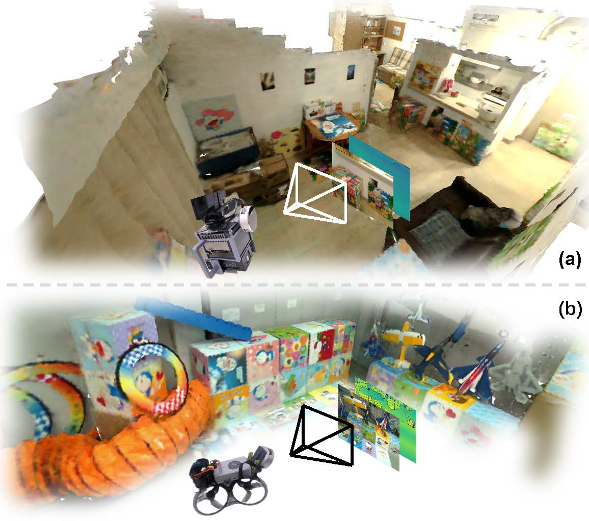
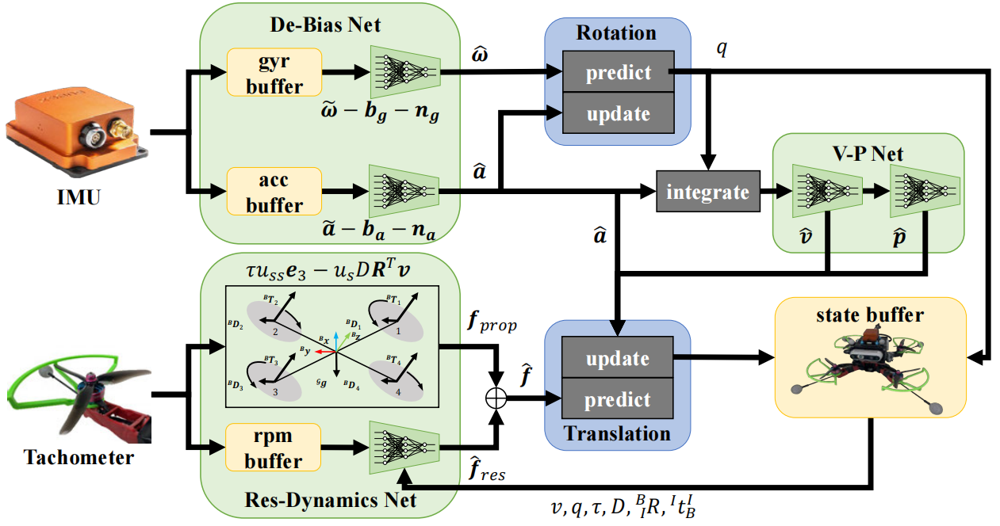

<html>
    <table style="width:100%;border:0px;border-spacing:0px;border-collapse:separate;margin-right:auto;margin-left:auto;">
          <tr onmouseout="nightsight_stop()" onmouseover="nightsight_start()">
            <td style="padding:20px;width:25%;vertical-align:middle;border-left-style:none;border-bottom-style:none;border-top-style:none;border-right-style:none">
              
            </td>
            <td style="padding:20px;width:75%;vertical-align:middle;border-left-style:none;border-bottom-style:none;border-top-style:none;border-right-style:none">
                <papertitle>H2-Mapping: Real-time Dense Mapping Using Hierarchical Hybrid Representation
                </papertitle>
               
                <strong>Chenxing JIANG</strong>, Hanwen Zhang, Peize Liu, Zehuan Yu, Hui Cheng, Boyu Zhou, Shaojie Shen
               
              <em>IEEE Robotics and Automation Letters, 2023.</em> 
              <a href="https://ieeexplore.ieee.org/document/10243098">Paper</a> /
              <a href="https://arxiv.org/abs/2306.03207">Arxiv</a> /
              <a href="https://github.com/SYSU-STAR/H2-Mapping">Code</a> /
              <a href="https://youtu.be/oR9MlfL86Vw">Video (Youtube)</a> /
              <a href="https://www.bilibili.com/video/BV1Ku411W7j2">Video (Bilibili)</a>
            </td>
          </tr>
    </table>
    <table style="width:100%;border:0px;border-spacing:0px;border-collapse:separate;margin-right:auto;margin-left:auto;">
          <tr onmouseout="nightsight_stop()" onmouseover="nightsight_start()">
            <td style="padding:20px;width:25%;vertical-align:middle;border-left-style:none;border-bottom-style:none;border-top-style:none;border-right-style:none">
              
            </td>
            <td style="padding:20px;width:75%;vertical-align:middle;border-left-style:none;border-bottom-style:none;border-top-style:none;border-right-style:none">
                <papertitle>WING: Wheel-Inertial-Neural Odometry with Ground Manifold Constraints
                </papertitle>
               
                Kunyi Zhang, <strong>Chenxing Jiang (co-first)</strong>, Sheng Yang, Shaojie Shen, Chao Xu, Fei Gao
               
              <em>Submitted to IEEE Transactions on Intelligent Transportation Systems, 2023.</em> 
              <a href="https://github.com/JIANG-CX/jiang-cx.github.io/blob/master/paper/WING_Wheel-Inertial-Neural_Odometry_with_Ground_Manifold_Constraints.pdf">Paper</a> /
              <a href="https://github.com/zhangkunyi/zhangkunyi.github.io/blob/main/paper/ICRA2023_KyZhang.mp4">Video</a> 
            </td>
          </tr>
    </table>
    <table style="width:100%;border:0px;border-spacing:0px;border-collapse:separate;margin-right:auto;margin-left:auto;">
          <tr onmouseout="nightsight_stop()" onmouseover="nightsight_start()">
            <td style="padding:20px;width:25%;vertical-align:middle;border-left-style:none;border-bottom-style:none;border-top-style:none;border-right-style:none">
              
            </td>
            <td style="padding:20px;width:75%;vertical-align:middle;border-left-style:none;border-bottom-style:none;border-top-style:none;border-right-style:none">
                <papertitle>DIDO:Deep Inertial Quadrotor Dynamical Odometry
                </papertitle>
               
                Kunyi Zhang, <strong>Chenxing Jiang</strong>, Jinghang Li, Sheng Yang, Teng Ma, Chao Xu, Fei Gao
               
              <em>IEEE Robotics and Automation Letters, 2022.</em> 
              <a href="https://ieeexplore.ieee.org/document/9817624">Paper</a> /
              <a href="https://github.com/zhangkunyi/DIDO/">Code</a> /
              <a href="https://www.bilibili.com/video/BV1dU4y1Z773?spm_id_from=333.999.0.0">Video (Bilibili)</a>
            </td>
          </tr>
    </table>
</html>

